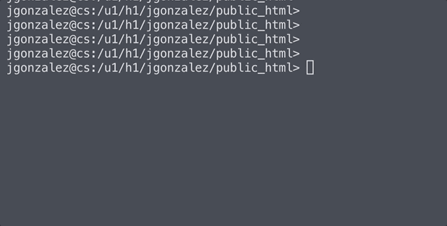

# 🌌 MatrixTerminal: Digital Rain in Your Bash 🌌

## Overview
👁️ **MatrixTerminal**: Dive into the cyber world with this enthralling Matrix-style animation crafted for your terminal. Utilizing the simplicity and power of BASH, this script brings the iconic Matrix digital rain to life. It's a perfect blend of nostalgia and tech, powered by `tput` and `printf` commands.

---

## 🚀 Sneak Peek

## Key Features
- **🔠 Customizable Charms**: Personalize your digital rain by modifying the `Char` global variable to display the character of your choice.
- **🎨 Artistic Animation**: Watch a mesmerizing cascade of characters, creating a visual spectacle on your screen.

---

## How It's Built
- **🖥️ Crafted with Care**: Uses basic `printf` functions in harmony with `tput` commands, simulating smooth animation frames in the terminal.

  _Note_: The animation's fluidity may vary on terminals with lower pixel resolutions, but the charm remains intact.

---

Immerse yourself in a digital downpour with **MatrixTerminal**. It's more than just a script; it's an artistic expression of code, bringing a piece of cinematic history into your daily computing experience. 🎬🖥️
